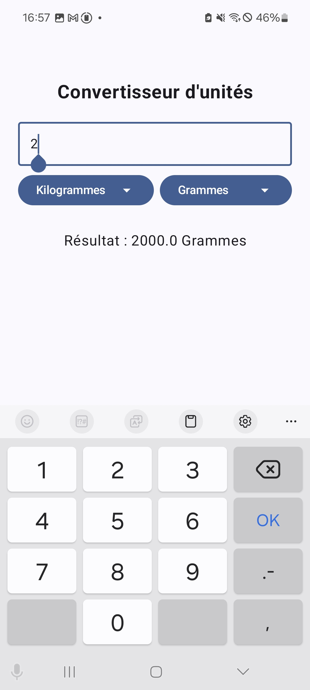
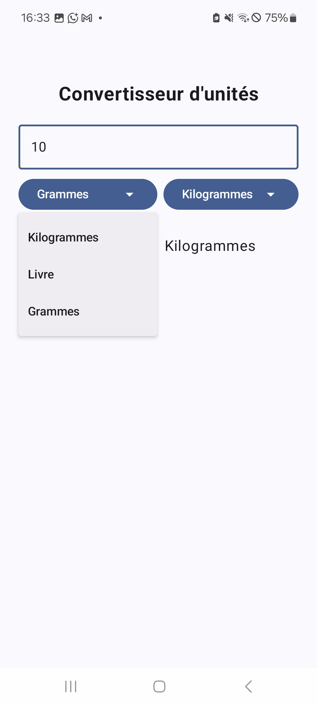
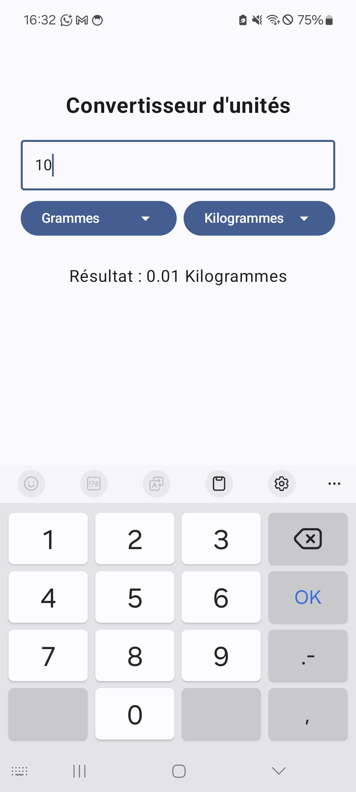

# Unit Converter Android App

A modern Android application built with Jetpack Compose that provides easy unit conversion between different weight measurements.

## Features

- **Real-time Conversion**: Instantly convert between different weight units
- **Multiple Units**: Support for Kilograms, Pounds, and Grams
- **Modern UI**: Built with Material Design 3 and Jetpack Compose
- **User-friendly Interface**: Clean and intuitive design with dropdown selectors
- **French Language**: Interface in French for better user experience

## Screenshots

### Main Interface

### Unit Selection

### Conversion Result

## Supported Conversions

The app supports conversions between:
- **Kilograms (kg)** ↔ **Pounds (lb)**
- **Kilograms (kg)** ↔ **Grams (g)**
- **Pounds (lb)** ↔ **Grams (g)**

## Technical Details

- **Language**: Kotlin
- **UI Framework**: Jetpack Compose
- **Minimum SDK**: Android API 21+
- **Target SDK**: Latest Android version

## Getting Started

1. Clone the repository
2. Open the project in Android Studio
3. Sync Gradle files
4. Run the app on an emulator or physical device

## Build Requirements
- Kotlin 1.8+
- Android Gradle Plugin 8.0+

## License

This project is open source and available under the MIT License.
